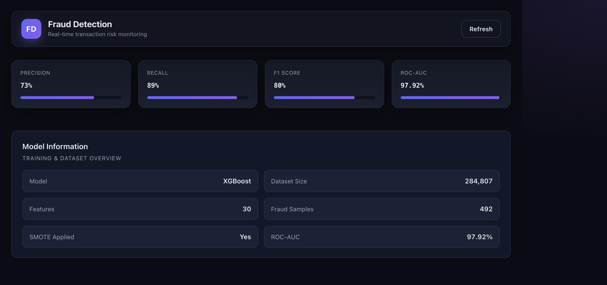
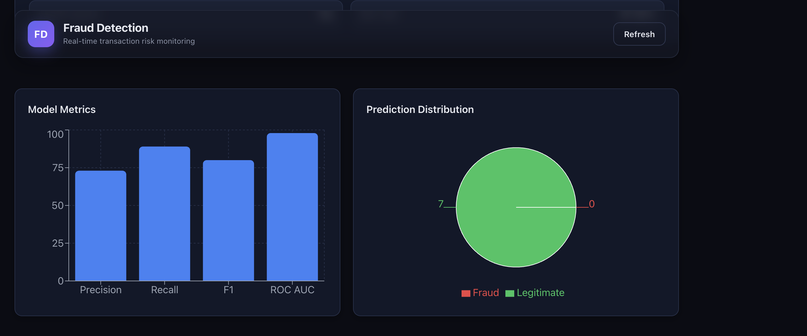
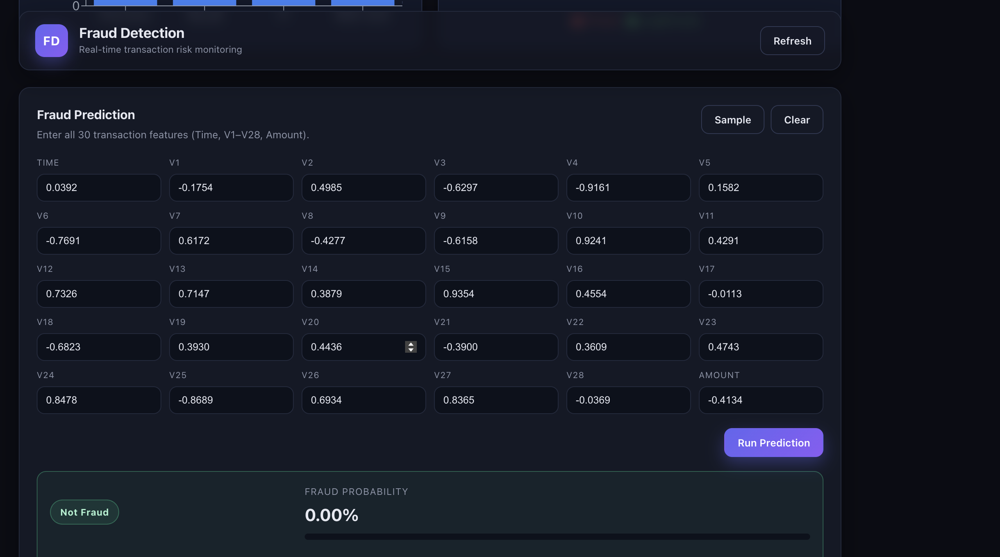
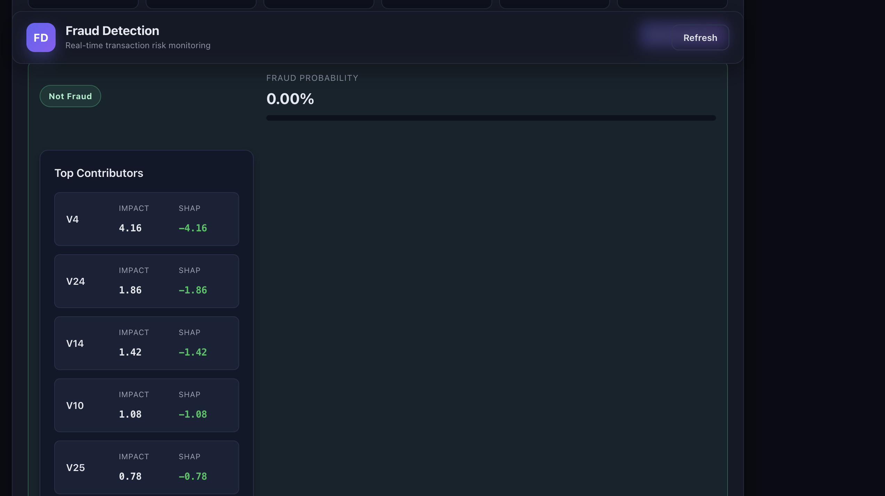
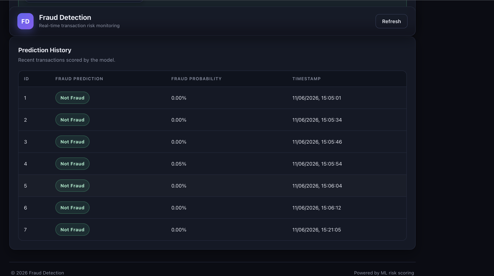

# Fraud Detection System using XGBoost, FastAPI, React & PostgreSQL

A full-stack machine learning application that detects fraudulent financial transactions in real-time using XGBoost, FastAPI, React, PostgreSQL, and SHAP explainability.

## Overview

This project uses a trained XGBoost machine learning model to identify potentially fraudulent financial transactions. Users can submit transaction features through a React dashboard, receive fraud predictions in real time, view prediction confidence scores, inspect SHAP-based explanations, and store prediction history in PostgreSQL.

## Deployment

Frontend deployed on Render Static Site.

Backend deployed on Render Web Service.

Database hosted on Neon PostgreSQL.

Production URLs:

Frontend:
https://fraud-frontend-vxzh.onrender.com

Backend:
https://fraud-backend-km6z.onrender.com

## Machine Learning Model

Algorithm: XGBoost Classifier

Dataset Size: 284,807 transactions

Fraud Cases: 492

Features: 30

Explainability: SHAP

ROC-AUC Score: 97.92%


## Features

- Real-time fraud prediction
- Fraud probability scoring
- SHAP explainability
- Transaction history storage
- PostgreSQL database integration
- Interactive analytics dashboard
- Model performance metrics
- Production deployment on Render
- Cloud database using Neon PostgreSQL

## Screenshots

### Dashboard

Main application dashboard displaying fraud detection metrics, model overview, and real-time monitoring information.



### Analytics Dashboard

Interactive charts showing model performance metrics and fraud prediction distribution.



### Fraud Prediction

Transaction feature input form allowing users to submit transaction data and receive real-time fraud probability predictions.



### SHAP Explanation

Explainable AI visualization showing the most influential features contributing to each fraud prediction using SHAP values.



### Transaction History

Historical record of all prediction requests, including fraud status, probability scores, and timestamps stored in PostgreSQL.


## Architecture

```text
React Frontend
       │
       ▼
FastAPI REST API
       │
 ┌─────┴─────┐
 ▼           ▼
XGBoost   PostgreSQL
 Model     Database
       │
       ▼
SHAP Explainability
```

## Project Structure

```text
fraud-detection-system
│
├── backend
│   ├── main.py
│   ├── database.py
│   ├── models_db.py
│   ├── requirements.txt
│   └── models
│
├── frontend
│   ├── src
│   ├── public
│   ├── package.json
│   └── vite.config.js
│
└── screenshots
```

## Tech Stack

Frontend
- React
- Vite
- Axios
- Chart.js

Backend
- FastAPI
- SQLAlchemy
- Pydantic

Machine Learning
- XGBoost
- SHAP
- NumPy
- Joblib

Database
- PostgreSQL
- Neon

Deployment
- Render

## API Endpoints

GET /
GET /metrics
GET /transactions
GET /health
GET /model-info

POST /predict

## Key Achievements

- Built full-stack ML application from scratch
- Deployed production frontend and backend
- Integrated PostgreSQL cloud database
- Implemented SHAP explainable AI
- Created analytics dashboard with Chart.js
- Achieved 97.92% ROC-AUC using XGBoost

## Installation

Clone repository

git clone https://github.com/Nikhil-VS1811/fraud-detection-system.git

Backend

cd backend
pip install -r requirements.txt
uvicorn main:app --reload

Frontend

cd frontend
npm install
npm run dev

## Sample Prediction Response

```json
{
  "fraud_prediction": 0,
  "fraud_probability": 0.05,
  "top_contributors": [
    {
      "feature": "V8",
      "impact": 2.65,
      "shap_value": -2.65
    }
  ]
}
```
## Future Improvements

- JWT Authentication
- Role Based Access Control
- CSV Batch Fraud Analysis
- Fraud Trend Forecasting
- Real-Time Streaming Predictions
- Docker & Kubernetes Deployment
- CI/CD Pipeline using GitHub Actions
- Advanced SHAP Visualizations

## Author

Nikhil VS

GitHub:
https://github.com/Nikhil-VS1811

LinkedIn:
(https://www.linkedin.com/in/nikhil-vs/)